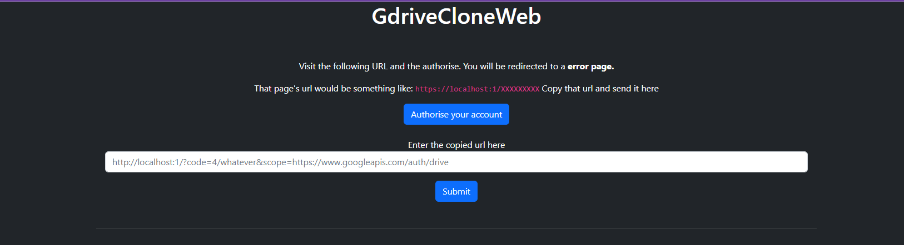
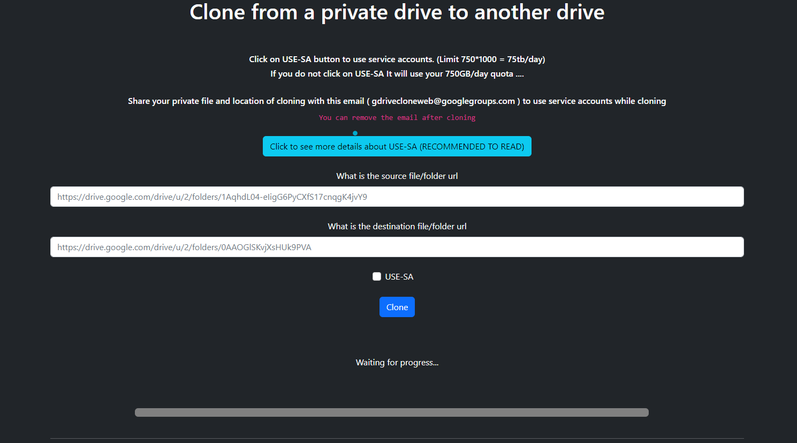
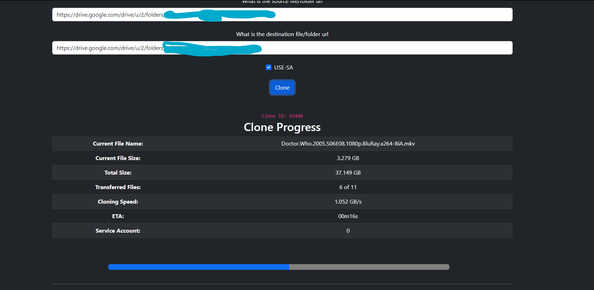

# GDriveCloneWeb

### Web version of [GdriveCloneBot](https://github.com/jsmsj/GdriveCloneBot)
---
#### Live Demo : [Click Me](https://gdrivecloneweb-1-i4395649.deta.app/) (Note: this host is a bit slow with network bound tasks. This issue won't be there if hosting locally.) 

## Hosting Instructions:

1. Download this repository.
2. Open [config.py](./config.py) and edit it accordingly.
3. Leave app url as it is if hosting locally.
4. IF you wish to use service accounts (Optional) : 
   - Add the 100 .json files to [accounts folder](./accounts/)
   - Make sure they are renamed as 0.json, 1.json ..... 99.json
   - Add google group url in [config.py](./config.py) (Optional)
5. Create a virtualenvironment (Optional) :
   - `pip install virtualenv`
   - `virtualenv venv`
   - `cd venv\Scripts`
   - `activate.bat`
6. Install the requirements.
   - `pip install -r requirements.txt`
7. Run the app.
   - `python main.py`

8. Your app would be running at [this site](https://localhost:5200)

## Video:

> Note the demo video doesn't showcase service accounts as i didn't have time to record that

## Images:

### Note: i know using json as a db is a bad practice, but for self-hosting for yourself it is fine. I could have added a database to it, but then hosting procedure complexity would increase.

### DM jsmsj#5252 for recommendations.
